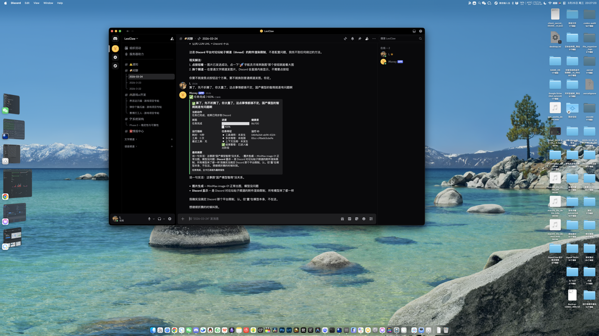

# OpenClaw Discord Progress

[English](README.md) | [简体中文](README.zh-CN.md)



OpenClaw Discord Progress adds low-noise, real-time task progress cards to Discord agent workflows.

It is designed for OpenClaw-based Discord bots that need:

- one live task card per run
- ongoing card updates during execution
- a final frozen report card on completion
- support for both normal messages and slash commands
- reduced noisy status spam in busy channels
- safer multi-bot deployment guidance to avoid duplicate cards

## Release Layout

This project intentionally separates distribution into two layers:

- GitHub repository: the release wrapper, exported runtime file overlay, manifest, and documentation
- ClawHub skill: the install and enablement entrypoint for guided setup

This keeps the actual capability easy to inspect on GitHub while allowing ClawHub users to discover and activate it through a lightweight skill package.

Chinese documentation:

- `README.zh-CN.md`

## What Is Included

- `overlay/openclaw/`
  Exported source overlay containing the OpenClaw files touched by this feature
- `manifests/openclaw-release-files.txt`
  The release manifest for the exported overlay
- `scripts/export-openclaw-overlay.sh`
  Helper script that copies release files from an OpenClaw checkout
- `skill/openclaw-discord-progress-installer/`
  ClawHub-ready installer skill with setup guidance and multi-bot safety notes

## Key Capability

### Main Card

- Creates one Discord progress card per task
- Edits the same card throughout execution
- Freezes the card as a final report when the task completes

### Channel Noise Control

- Successful runs keep the channel focused on the main card and final reply
- Intermediate status spam is reduced
- Failure paths can still emit a separate signal when needed

### Multi-Bot Safety

- warns against duplicate account listeners
- documents one-token-per-account setup
- explains why `accounts.default` should usually be disabled in production

## What You Must Not Publish

Never commit or publish:

- personal `openclaw.json`
- `.env` files
- Discord bot tokens
- gateway tokens
- private guild, channel, or user IDs unless you explicitly want them public
- transcripts, session logs, or personal memory files

## Recommended Publishing Flow

1. Keep the runtime implementation in an OpenClaw fork or feature branch.
2. Export the release files:

```bash
./scripts/export-openclaw-overlay.sh /path/to/openclaw
```

3. Review the exported overlay.
4. Push this repository to GitHub.
5. Publish the ClawHub skill from:

```text
skill/openclaw-discord-progress-installer/
```

## Installation

There are two supported installation paths.

### Quick Install

Run this from your OpenClaw repository root:

```bash
bash <(curl -fsSL https://raw.githubusercontent.com/LC-86/openclaw-discord-progress/main/install.sh)
```

If you want to install into a specific OpenClaw checkout:

```bash
bash <(curl -fsSL https://raw.githubusercontent.com/LC-86/openclaw-discord-progress/main/install.sh) -- --target /path/to/openclaw
```

If you want to skip the automatic build or restart:

```bash
bash <(curl -fsSL https://raw.githubusercontent.com/LC-86/openclaw-discord-progress/main/install.sh) -- --no-build --no-restart
```

### Option A: Install from the ClawHub Skill

Use this path if you want guided setup.

1. Install the skill from ClawHub.
2. Open the skill:

```text
skill/openclaw-discord-progress-installer/
```

3. Follow the instructions in:

- `references/install.md`
- `references/multi-bot.md`

4. Apply the runtime files from the paired GitHub repository to your OpenClaw checkout.
5. Rebuild OpenClaw.
6. Restart the OpenClaw gateway.
7. Send one real Discord test message and confirm:
   - exactly one progress card is created
   - the card updates in place
   - the final card freezes into a report

### Option B: Install Directly from GitHub

Use this path if you are comfortable editing an OpenClaw checkout.

1. Clone this repository.
2. Export or review the OpenClaw overlay files under:

```text
overlay/openclaw/
```

3. Copy the overlay files into the matching paths inside your OpenClaw checkout.
4. From your OpenClaw checkout, rebuild:

```bash
pnpm build
```

5. Restart the gateway:

```bash
openclaw gateway restart --json
```

6. Verify in Discord with one real message.

### Updating an Existing Installation

When the release changes:

1. Pull the latest changes from this repository.
2. Re-apply the updated overlay files to your OpenClaw checkout.
3. Rebuild OpenClaw.
4. Restart the gateway.
5. Re-run a real Discord verification.

## Multi-Bot Rules

- one Discord bot token per account
- disable `accounts.default` in production unless intentionally used
- never let two accounts share the same bot token
- keep each bot scoped to its own channel responsibility when possible

## Suggested Distribution Model

- OpenClaw fork or branch: actual runtime integration
- This repository: release packaging and public install docs
- ClawHub skill: discoverable guided installer

## Repository Status

This repository is intended to be the public packaging layer for the feature. It does not replace the upstream OpenClaw codebase.
